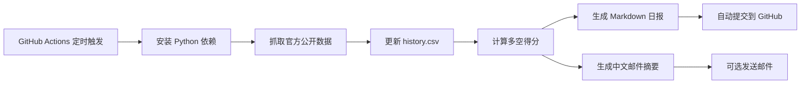

# GoldHunter

[](https://github.com/lihaoyuan-afk/github-ai-daily-report/actions/workflows/goldhunter-daily.yml)

GoldHunter 是一个黄金宏观环境自动监控项目。它会每天抓取黄金、美债收益率、美元强弱指标、黄金 ETF 官方持仓和原油价格，自动保存历史数据，并生成一份中文 Markdown 日报，判断当前环境对黄金是偏多、偏空还是震荡。

项目已经接入 GitHub Actions，可以实现无人值守运行、自动生成报告、自动提交结果，并可选发送一封简短中文邮件。

## 当前能力

| 能力 | 说明 |
| --- | --- |
| 自动抓取数据 | 使用 SPDR 官方档案和 FRED 官方经济序列 |
| 保存历史 | 每次运行更新 `GoldHunter/data/history.csv` |
| 对比变化 | 自动比较上一可用交易日和 7 日前变化 |
| 多空打分 | 根据利率、美元、黄金、ETF、原油五类指标综合打分 |
| 生成日报 | 输出 `GoldHunter/reports/daily_report.md` |
| 邮件摘要 | 输出 `GoldHunter/reports/email_summary.md`，内容简短中文 |
| GitHub 自动化 | 定时运行、手动运行、自动提交报告结果 |

## 数据源

| 指标 | 当前官方口径 | 来源 | 用途 |
| --- | --- | --- | --- |
| 黄金价格 | GLD 官方收盘价 | SPDR Gold Shares Historical Archive | 判断黄金相关价格动能 |
| 美国10年期国债收益率 | `DGS10` | FRED / Federal Reserve H.15 | 衡量实际利率和机会成本压力 |
| 美元强弱指标 | `DTWEXBGS` | FRED / Federal Reserve H.10 | 衡量美元强弱对黄金的影响 |
| 黄金 ETF 资金流向 | GLD 官方黄金持仓吨数变化 | SPDR Gold Shares Historical Archive | 判断 ETF 端净流入/净流出 |
| 原油价格 | `DCOILWTICO` | FRED / U.S. EIA | 观察通胀和利率预期扰动 |

公开官方数据源可能会出现发布延迟或临时不可用。程序会记录提示并继续生成报告，不会因为单个指标失败而中断。

说明：ICE DXY、LBMA 金价、CME 黄金期货的实时官方接口通常需要授权或付费许可。当前版本优先使用无需密钥、可自动化抓取的官方公开数据。美元指标使用美联储广义美元指数，不再使用 Yahoo Finance 的 DXY。

## 打分规则

| 条件 | 得分 | 含义 |
| --- | ---: | --- |
| US10Y 下降 | `+1` | 利率压力下降，利多黄金 |
| US10Y 上升 | `-1` | 持有黄金机会成本上升 |
| DXY 下降 | `+1` | 美元走弱，利多黄金 |
| DXY 上升 | `-1` | 美元走强，压制黄金 |
| GLD 官方收盘价上涨 | `+1` | 黄金相关价格动能偏强 |
| GLD 官方收盘价下跌 | `-1` | 黄金相关价格动能偏弱 |
| GLD 官方持仓增加 | `+1` | ETF 端净流入 |
| GLD 官方持仓下降 | `-1` | ETF 端净流出 |
| 原油明显回落 | `+0.5` | 通胀压力边际缓和 |
| 原油明显上涨 | `-0.5` | 通胀和利率预期可能升温 |

综合判断：

| 综合得分 | 判断 |
| ---: | --- |
| `>= 2` | 偏多 |
| `<= -2` | 偏空 |
| 其他 | 震荡 |

## 自动化流程



## 输出文件

| 文件 | 说明 |
| --- | --- |
| `GoldHunter/data/history.csv` | 每日历史数据 |
| `GoldHunter/reports/daily_report.md` | 完整中文日报 |
| `GoldHunter/reports/email_summary.md` | 简短中文邮件摘要 |

邮件摘要示例：

```text
日期：2026-06-16
结论：偏多
得分：3
简述：利多：GLD官方收盘价；利空：美联储广义美元指数
```

## 项目结构

```text
GoldHunter/
├─ main.py              # 主入口
├─ data_fetcher.py      # 官方数据抓取
├─ analyzer.py          # 指标分析和打分
├─ report.py            # 报告和邮件摘要生成
├─ config.py            # 配置项
├─ requirements.txt     # Python 依赖
├─ data/
│  └─ history.csv       # 运行后生成
└─ reports/
   ├─ daily_report.md   # 运行后生成
   └─ email_summary.md  # 运行后生成
```

## GitHub Actions

工作流文件：

```text
.github/workflows/goldhunter-daily.yml
```

触发方式：

| 方式 | 说明 |
| --- | --- |
| 定时运行 | 每天北京时间 `07:30` 自动执行 |
| 手动运行 | 在 GitHub Actions 页面点击 `Run workflow` |
| 代码变更 | 修改 `GoldHunter` 或工作流文件后自动执行 |

自动化会执行：

1. 拉取仓库代码。
2. 安装 Python 依赖。
3. 运行 `GoldHunter/main.py`。
4. 生成数据和报告。
5. 如已配置邮箱密钥，发送简短中文邮件。
6. 自动提交 `data` 和 `reports` 目录的变化。

## 邮件配置

如需自动发送邮件，请在仓库中添加 Actions Secrets：

路径：`Settings` -> `Secrets and variables` -> `Actions` -> `New repository secret`

| Secret | 必填 | 示例 |
| --- | --- | --- |
| `MAIL_SERVER` | 是 | `smtp.gmail.com` |
| `MAIL_PORT` | 否 | `465` 或 `587` |
| `MAIL_USERNAME` | 是 | 发件邮箱账号 |
| `MAIL_PASSWORD` | 是 | 邮箱密码或应用专用密码 |
| `MAIL_TO` | 是 | 收件邮箱 |
| `MAIL_FROM` | 否 | 发件人地址 |

邮件正文只输出中文摘要，并保持尽可能简短。

配置完成后，可以在 GitHub Actions 页面手动运行一次工作流，或推送一次小改动来验证真实邮件发送。

## 本地运行

Windows PowerShell：

```powershell
cd "E:\新建文件夹 (4)\fundconnecthk.com-main\GoldHunter"
python -m venv .venv
.\.venv\Scripts\Activate.ps1
pip install -r requirements.txt
python main.py
```

macOS / Linux：

```bash
cd /path/to/GoldHunter
python -m venv .venv
source .venv/bin/activate
pip install -r requirements.txt
python main.py
```

## 注意事项

- 本项目使用官方公开数据源，数据可能延迟、缺失或临时不可用。
- ETF 资金流向已改为 SPDR 官方黄金持仓吨数变化。
- ICE/LBMA/CME 实时官方数据通常需要商业授权；当前项目不绕过许可限制。
- 报告仅用于宏观环境观察和研究记录，不构成投资建议。
